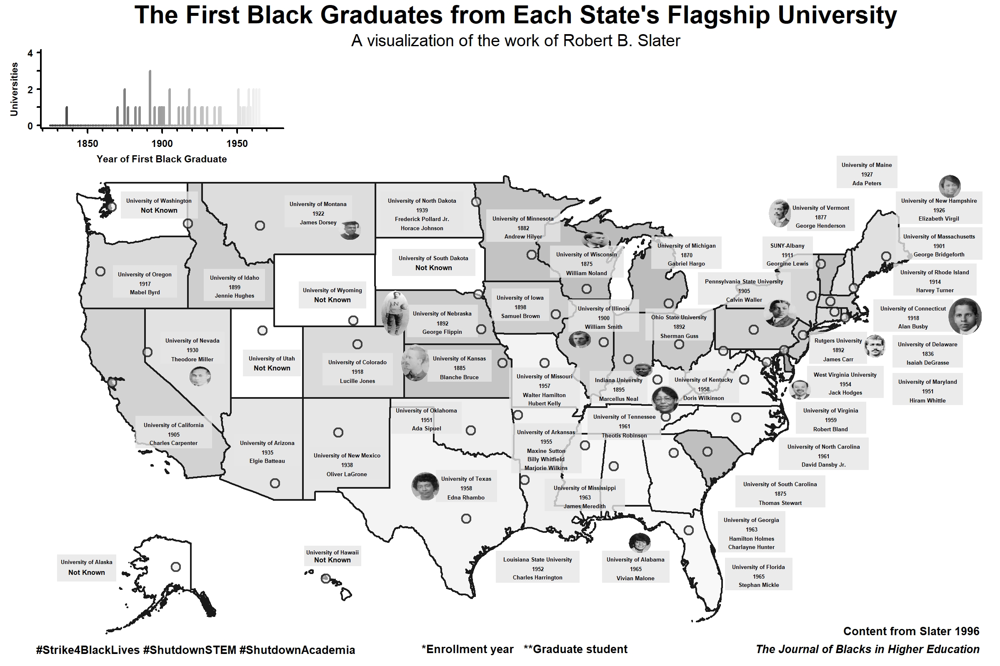

# Mapping the First Black Graduates in American Colleges

Academia has a legacy of racism, white supremacy, and colonialism that persists to this day and which must be confronted head-on by white people.

Something that many privileged folks like myself take for granted is that we have access at all to higher education. 

However, many American universities have been closed to black students for much of their history.

The opening of admissions to black students is one step in a long journey of making higher education equitable, but it is an important part of history that I realized I knew nearly nothing about.

Not only did I not know *when* the first black students were admitted to universities I attended, I had no idea *who* these important figures were--what their names were, what they studied, what crap they had to deal with, and how amazing they were in the face of it. 

This project was started as part of the [#Strike4BlackLives #ShutdownSTEM #ShutdownAcademia](www.shutdownstem.com) with the intent of learning about this important history through digitizing and visualizing data from studies on black students in academia by Slater (1994, 1996) and JBHE (2002, 2007, 2009).

In putting together this map, I had the opportunity to read about so many ground-breaking badass students whose stories I am honored to help share.

BLACK LIVES MATTER

Author of the present code: Dr. Juniper L. Simonis (they/them)

Based on research by Robert Bruce Slater.

## Status

This project is a work in progress.

I have presently just mapped the data from Slater (1996), representing the first black graduates from the 50 flagship state universities in America.

## References

JBHE. 2002. The earliest black graduates of the nation's highest-ranked liberal arts colleges. The Journal of Blacks in Higher Education 38:104-109.

JBHE. 2007. The first black graduates at the University of Texas. The Journal of Blacks in Higher Education 55:42.

JBHE. 2009. New information on the first black graduates at the University of Notre Dame. The Journal of Blacks in Higher Education 63:43-44.

Slater, R. B. 1994. The blacks who first entered the world of white higher education. The Journal of Blacks in Higher Education 4:47-56.

Slater, R. B. 1996. The first black graduates of the nation's 50 flagship state universities. The Journal of Blacks in Higher Education 13:72-85.